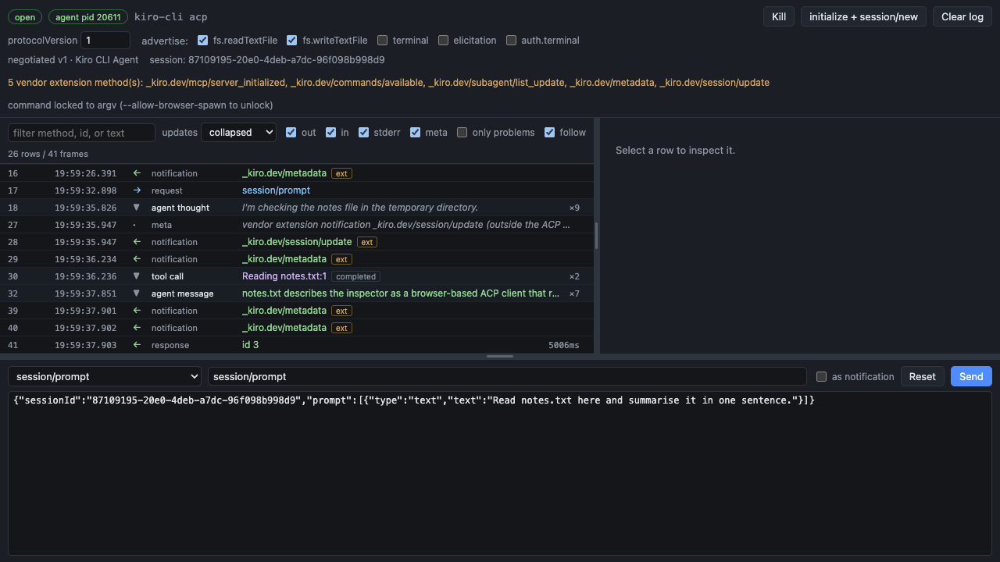

# ACP Debugger

A browser-based client and debugger for the [Agent Client Protocol](https://agentclientprotocol.com). It launches an ACP agent over stdio and gives you a live view of JSON-RPC traffic, streamed messages, tool calls, permission requests, stderr, and protocol errors.



## Quick start

Requires Node.js 22 or newer.

```bash
npx @ryancormack/acp-debugger -- <your-agent-command>
```

Two common examples:

**Kiro CLI**

```bash
npx @ryancormack/acp-debugger \
  --cwd ~/code/my-project \
  -- kiro-cli acp
```

**A TypeScript agent package that needs AWS configuration**

```bash
npx @ryancormack/acp-debugger \
  --cwd ~/code/my-project \
  --env AWS_PROFILE=my-profile \
  --env AWS_REGION=us-east-1 \
  -- node ~/code/my-agent/packages/agent/dist/acp-agent.cjs
```

The debugger prints and opens a tokenised local URL. In the browser:

1. Select **Launch** to start the agent.
2. Select **initialize + session/new** to negotiate capabilities and create a session.
3. Compose a `session/prompt` and select **Send**.

See the [usage walkthrough](docs/usage.md) for a complete debugging session with screenshots.

## What you can do

- Capture every inbound and outbound JSON-RPC frame, plus the agent's stderr.
- Read streamed messages as a collapsed transcript or inspect the original frames.
- Inspect tool-call input, output, content blocks, file locations, and diffs.
- Answer `session/request_permission` and `elicitation/create` requests in the browser.
- Toggle advertised client capabilities to test how an agent degrades.
- Compose valid or deliberately malformed requests with free-form JSON.
- Cancel an in-flight prompt and verify that the agent reports a cancelled turn.
- Filter the timeline by direction, message kind, method, text, or problems only.
- See vendor extension methods, such as `_kiro.dev/*`, without losing their frames.
- Resize the timeline, detail, and composer panes; sizes persist across reloads.

## Running an agent

Everything after `--` is the command used to start the agent. Use `--cwd` to set the agent's working directory and the `cwd` sent in `session/new`:

```bash
npx @ryancormack/acp-debugger \
  --cwd ~/code/my-project \
  -- node dist/acp-agent.cjs
```

Pass agent-specific configuration with repeatable `--env` options:

```bash
npx @ryancormack/acp-debugger \
  --cwd ~/code/my-project \
  --env AWS_PROFILE=my-profile \
  --env AWS_REGION=us-east-1 \
  -- ~/code/my-agent/dist/acp-agent.cjs
```

The session cwd also confines ACP `fs/read_text_file` and `fs/write_text_file` callbacks. Requests cannot access paths outside it.

## Reading the timeline

A real agent can emit hundreds of `session/update` notifications during one turn. The **updates** filter controls how they appear:

| Setting | Result |
| --- | --- |
| `collapsed` | Reassembles chunks into messages and groups tool-call updates. This is the default. |
| `raw frames` | Shows every notification exactly as it crossed stdio. |
| `hidden` | Hides `session/update` rows. |

Collapsed rows retain links to every source frame, so folding the transcript does not discard the underlying traffic. Selecting a tool call shows its latest status and all available `rawInput`, `rawOutput`, locations, content blocks, and diffs.

## Acting as an ACP client

ACP agents call methods on their client, so observing stdio alone is not enough to complete many turns. ACP Debugger implements the client-side interactions needed for useful testing:

| Agent call | Behaviour |
| --- | --- |
| `session/update` | Captured and folded into readable transcript rows. |
| `session/request_permission` | Held open until you choose one of the agent's options, cancel it, or return an error. |
| `elicitation/create` | Held open for a manual response. |
| `fs/read_text_file` / `fs/write_text_file` | Performed when advertised, within the session cwd. |
| `terminal/*` | Not implemented; leave terminal capabilities disabled. |

The capability checkboxes control what is advertised during `initialize`. If an agent calls a capability-dependent method that was not advertised, the debugger returns `-32601` instead of silently accepting the call.

## Finding protocol problems

Frames are checked against the ACP schema supplied by `@agentclientprotocol/sdk`. Problem rows are flagged in the timeline, including:

- non-JSON output on stdout
- params that do not match the method
- empty session IDs on session-scoped calls
- responses with no matching request
- requests still unanswered when the process exits
- non-cancelled prompt responses after cancellation

The composer intentionally remains permissive. You can edit the method and params, send malformed traffic, and observe how the agent responds.

Vendor extension methods are retained and marked with an `ext` badge. They are surfaced rather than treated as standard ACP methods or silently ignored.

## CLI options

```text
--port <n>              Port to serve on (default 6274)
--cwd <path>            Working directory for the agent and the ACP session
--env KEY=VALUE         Extra environment variable for the agent (repeatable)
--allow-browser-spawn   Permit editing the agent command from the browser
--no-open               Do not open a browser
--dev                   Also accept websockets from the Vite dev server on 6275
-h, --help              Show usage
```

The browser cannot change the agent command unless you explicitly pass `--allow-browser-spawn`.

## Security

ACP Debugger runs commands and may service filesystem requests on your machine. Its local control plane is restricted accordingly:

- the server binds only to `127.0.0.1`
- each run requires a random session token
- WebSocket handshakes validate the token, `Host`, and `Origin`
- the agent command comes from the CLI by default, not from the browser
- filesystem callbacks are confined to the session cwd

Only run agents you trust, and review requested permissions before allowing tool calls.

## Troubleshooting

**The agent launches, but `initialize` never completes.** Confirm the command starts an ACP server rather than an interactive or one-shot chat process. For Kiro CLI, use `kiro-cli acp`, not `kiro-cli chat --no-interactive`.

**The agent reports `No session found with id`.** Run **initialize + session/new** before sending a session-scoped request. The composer warns when no active session ID is available.

**An `fs/*` method returns `-32601`.** Enable the corresponding capability before initializing, then create a new session. A method called without its advertised capability is treated as an agent error.

**A row contains prose or escape codes instead of JSON.** The agent wrote non-protocol output to stdout. ACP reserves stdout for JSON-RPC; diagnostic output belongs on stderr. Enable **only problems** to isolate these rows.

## Development

```bash
pnpm install
pnpm build
pnpm test
pnpm typecheck
```

For UI development, run the CLI with `--dev` and run `pnpm dev:ui` in another terminal. The test suite includes transcript unit tests and an end-to-end session against the stub ACP agent.

## License

MIT
