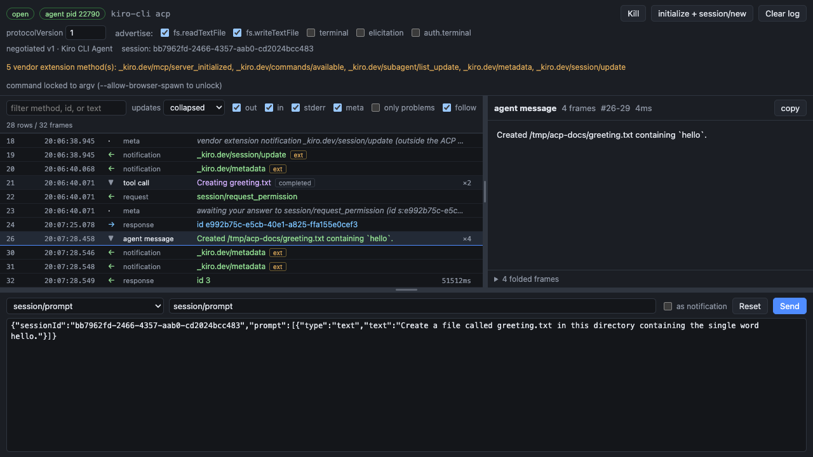
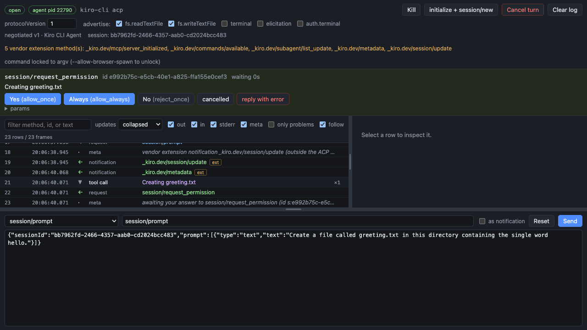
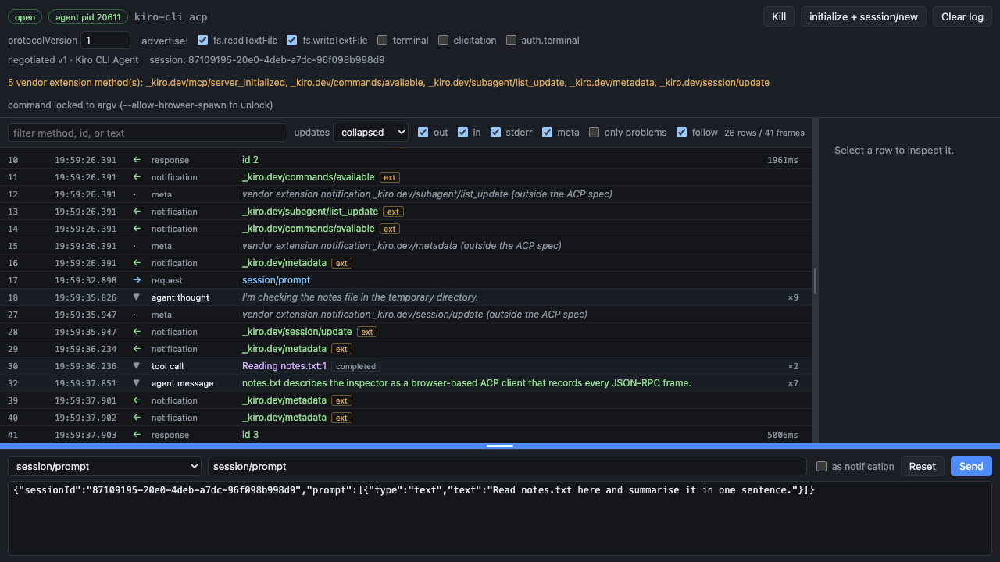

# Using the ACP debugger

A walkthrough of a debugging session, in the order you actually do things.

## Run it

```bash
npx @ryancormack/acp-debugger -- <your-agent-command>
```

The command after `--` is spawned as the agent. Two real examples:

```bash
# Kiro CLI
npx @ryancormack/acp-debugger --cwd ~/code/my-project -- kiro-cli acp

# A Node agent that needs AWS credentials
npx @ryancormack/acp-debugger \
  --cwd ~/code/my-project \
  --env AWS_PROFILE=my-profile \
  --env AWS_REGION=us-east-1 \
  -- ~/code/my-agent/dist/acp-agent.cjs
```

Credentials and config must go through `--env`. They are injected into the
agent's environment when it is spawned, so a shell prefix on the debugger's own
command line does not reach it.

`--cwd` is the agent's working directory, the `cwd` sent in `session/new`, and the
confinement root for any `fs/*` callbacks.

A tokenised `http://127.0.0.1:6274/?token=...` URL is printed and opened.

## The first three clicks

1. **Launch** spawns the agent. The toolbar switches to `agent pid <n>`.
2. **initialize + session/new** sends both calls back to back. The toolbar then
   shows the negotiated protocol version, the agent's name, and the session id.
3. Pick `session/prompt` in the composer, edit the text, **Send**.


If the toolbar still says `not initialized` and `session: none`, nothing answered.
See [Troubleshooting](#troubleshooting).

## Reading the timeline

Each row is one frame, or one folded group of frames.

| Column | Meaning |
| --- | --- |
| `#` | Sequence number, in capture order |
| time | Wall clock, to the millisecond |
| arrow | `→` client to agent, `←` agent to client, `░` stderr, `·` inspector note |
| kind | `request`, `response`, `error`, `notification`, `meta`, or the group label |
| label | Method name, or the reassembled text for a group |
| right | Round-trip time on a response, `×N` frames folded on a group |

Colour follows direction: outbound blue, inbound green, stderr amber. A flagged
row turns red and carries a `!`.

### The updates control

A real agent streams token by token, so one prompt can produce hundreds of
`session/update` notifications. The `updates` dropdown decides what you see:

- `collapsed` (default): one row per message, tool call, or plan, with the chunks
  joined into readable text
- `raw frames`: every frame individually, as it crossed stdio
- `hidden`: no `session/update` rows at all

Selecting a collapsed row shows the full reassembled text, plus a list of every
folded frame as a link that jumps to the raw frame.



Grouping follows the protocol rather than guessing. Chunks are keyed by
`messageId`, so a message survives a tool call interleaved into the middle of it.
A `tool_call` and all its `tool_call_update`s become one row carrying the latest
status.

## Tool calls

A tool call row carries the parts worth debugging, gathered from across its
updates:

- `rawInput`, the arguments the agent actually passed
- `rawOutput`
- `locations`, the files it touched
- `content` blocks, with `diff` blocks showing both sides verbatim

`tool_call_update` supplies whole fields rather than deltas, so the latest update
carrying a field replaces it and an update that omits one leaves the earlier value
intact.

## Answering permission requests

When the agent sends `session/request_permission`, a panel appears above the
timeline with the agent's own options rendered as buttons, plus `cancelled` and
`reply with error`.



This is not optional politeness. `session/request_permission` is mandatory
baseline in ACP, so an agent that gates a tool call and never gets an answer stops
dead. Until you answer, the turn is blocked, and the response time on the eventual
`session/prompt` reply includes your thinking time.

## Toggling client capabilities

The `advertise:` checkboxes decide what goes into `clientCapabilities` on
`initialize`. This is the reason the tool exists as a client rather than a sniffer.

Turn `fs.readTextFile` off, press **initialize + session/new** again, and send the
same prompt. A well-behaved agent degrades; a fragile one falls over. Editors
generally advertise everything, so these branches are otherwise never exercised.

Calling a method whose capability you did not advertise gets `-32601` rather than
being quietly serviced, because that is the agent's bug and hiding it defeats the
tool.

## Cancelling a turn

While a `session/prompt` is in flight the toolbar shows **Cancel turn**. It sends
`session/cancel`, answers every outstanding permission request with the
`cancelled` outcome as ACP requires of the client, and then flags it if the
agent's `session/prompt` reply comes back with any `stopReason` other than
`cancelled`.

## Composing traffic by hand

The method dropdown lists every method in the SDK's registry. The method field
beside it is editable, and params are free-form JSON serialised exactly as
composed.

Sending a request with a string id, a missing `jsonrpc`, or params belonging to a
different method is a supported use. Half of debugging an agent is seeing how it
handles traffic a well-behaved editor would never send.

**Reset** discards your edits and refills from the template. Hand-typed params are
never overwritten by incoming traffic.

## What gets flagged

- **Non-JSON on stdout.** ACP says the agent MUST NOT write anything to stdout
  that is not an ACP message. A stray `console.log` is the most common agent bug
  and it corrupts the stream for every real client.
- **Wrong params for the method**, validated against the ACP JSON Schema that
  ships inside the SDK.
- **A session-scoped call with an empty `sessionId`**, which the schema cannot
  catch because ACP types `SessionId` as a bare string.
- **Responses matching no outstanding request**, and requests never answered when
  the process exited.

Tick `only problems` in the filter bar to see nothing else.

## Vendor extensions

ACP reserves a leading `_` for implementation-specific extensions, so
`_kiro.dev/metadata` is legal traffic. Those frames get an `ext` badge, the toolbar
lists every extension method the agent has used, and each is announced once when
first seen. Anything your agent relies on an extension for will not work against a
client that does not implement it.

## Adjusting the layout

Two drag handles: one between the timeline and the detail pane, one above the
composer. Both sizes persist across reloads.

The handles are keyboard operable. Focus one and use the arrow keys, Shift plus an
arrow for a coarser step, and Home or double-click to restore the default.

Widening the timeline is often what you want, since a truncated row hides the
reassembled text that makes the collapsed view useful.



## Troubleshooting

**Nothing comes back and the toolbar says `not initialized`.** The spawned process
is probably not an ACP agent. The common case is a chat mode rather than a
protocol mode: `kiro-cli chat --no-interactive` reads stdin as a question and waits
for EOF, but an ACP client holds stdin open for the whole session, so neither side
ever proceeds. Use `kiro-cli acp`.

**`-32603 No session found with id`.** A session-scoped call went out before
`session/new` returned. Press **initialize + session/new** first. The composer
warns about this before you send.

**`-32601` on an `fs/*` or `terminal/*` call.** The agent called a method whose
capability you did not advertise. Either tick the capability or treat it as an
agent bug.

**A row shows escape codes or prose instead of JSON.** The agent wrote non-ACP
output to stdout. Find it with `only problems`.

## Options

```
--port <n>              Port to serve on (default 6274)
--cwd <path>            Working directory for the agent and the ACP session
--env KEY=VALUE         Extra environment variable for the agent (repeatable)
--allow-browser-spawn   Permit editing the agent command from the browser
--no-open               Do not open a browser
--dev                   Also accept websockets from the Vite dev server on 6275
-h, --help              Show usage
```
